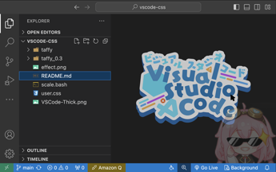

# vscode-css

> 更好看的 VSCode 图标

based on extension: "Custom CSS and JS Loader".

usage:

Install Custom CSS and JS Loader extension.

In your VSCode, `ctrl + shift + p`(or`command + shift + p` for mac) open and edit the `settings.json`, add the following content:

```json json
{
  "vscode_custom_css.imports": [
    "https://taf.fyi/vscode-css/user.css"
  ],
}
```

then `ctrl + shift + p`(or`command + shift + p` for mac) again, type `Reload Custom CSS and JS`. Then your VSCode will tell you t o restart and the config shall make effect.

# background

> 塔菲表情包替代插件默认的东方小人，随机图片来自：https://github.com/fuuzen/random-taffy

based on VSCode extension: "background".

edit the `settings.json`, add the following content:

```json json
{
  "background.editor": {
    "useFront": true,
    "style": {
      "background-position": "100% 100%",
      "opacity": 0.3
    },
    "images": [
      "https://random.taf.fyi",
    ],
    "interval": 0,
  }
}
```

