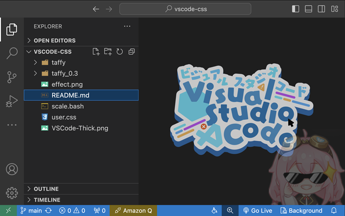

# vscode-css

based on extension: Custom CSS and JS Loader

effect:



usage:

Install Custom CSS and JS Loader extension.

In your VSCode, `ctrl + shift + p`(or`command + shift + p` for mac) open and edit the `settings.json`, add the following content:

```json json
{
    "vscode_custom_css.imports": [
        "https://raw.githubusercontent.com/fuuzen/vscode-css/main/user.css"
    ],
}
```

then `ctrl + shift + p`(or`command + shift + p` for mac) again, type `Reload Custom CSS and JS`. Then your VSCode will tell you t o restart and the config shall make effect.