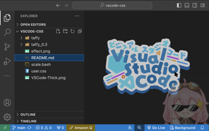

# vscode-css

based on extension: Custom CSS and JS Loader

effect:



usage:

Install Custom CSS and JS Loader extension.

In your VSCode, `ctrl + shift + p`(or`command + shift + p` for mac) open and edit the `settings.json`, add the following content:

```json json
{
    "vscode_custom_css.imports": [
        "https://raw.githubusercontent.com/fuuzen/vscode-css/main/user.css"
    ],
}
```

then `ctrl + shift + p`(or`command + shift + p` for mac) again, type `Reload Custom CSS and JS`. Then your VSCode will tell you t o restart and the config shall make effect.

# background

based on VSCode extension: background.

edit the `settings.json`, add the following content:

```json json
{
    "background.editor": {
        "useFront": true,
        "style": {
            "background-position": "100% 100%",
            "background-size": "20%",
            "opacity": 0.3
        },
        "images": [
            "https://raw.githubusercontent.com/fuuzen/vscode-css/main/taffy/taffynyaAgAD0AUAAidDwFQ.png",
            "https://raw.githubusercontent.com/fuuzen/vscode-css/main/taffy/taffynyaAgAD1QQAArFzwVU.png",
            "https://raw.githubusercontent.com/fuuzen/vscode-css/main/taffy/taffynyaAgAD0AcAAphWoFU.png",
            "https://raw.githubusercontent.com/fuuzen/vscode-css/main/taffy/taffynyaAgAD1gYAAmwL4FQ.png",
            "https://raw.githubusercontent.com/fuuzen/vscode-css/main/taffy/taffynyaAgAD2AUAAoT9CVc.png",
            "https://raw.githubusercontent.com/fuuzen/vscode-css/main/taffy/taffynyaAgAD2QMAApOjwVQ.png",
            "https://raw.githubusercontent.com/fuuzen/vscode-css/main/taffy/taffynyaAgAD2wYAAmRr2FQ.png   ",
            "https://raw.githubusercontent.com/fuuzen/vscode-css/main/taffy/taffynyaAgAD2gYAAgbi2VQ.png",
            "https://raw.githubusercontent.com/fuuzen/vscode-css/main/taffy/taffynyaAgAD3AcAAklX2FQ.png",
            "https://raw.githubusercontent.com/fuuzen/vscode-css/main/taffy/taffynyaAgAD5AMAAgpnwFQ.png",
            "https://raw.githubusercontent.com/fuuzen/vscode-css/main/taffy/taffynyaAgAD5QYAArRh2VQ.png",
            "https://raw.githubusercontent.com/fuuzen/vscode-css/main/taffy/taffynyaAgAD5gkAAmkuoFU.png",
            "https://raw.githubusercontent.com/fuuzen/vscode-css/main/taffy/taffynyaAgAD6AQAAhTsuVQ.png   ",
            "https://raw.githubusercontent.com/fuuzen/vscode-css/main/taffy/taffynyaAgAD6gYAAnnaAVc.png",
            "https://raw.githubusercontent.com/fuuzen/vscode-css/main/taffy/taffynyaAgAD8wQAAlUUAAFX.png",
            "https://raw.githubusercontent.com/fuuzen/vscode-css/main/taffy/taffynyaAgAD9AYAAjXY2VQ.png",
            "https://raw.githubusercontent.com/fuuzen/vscode-css/main/taffy/taffynyaAgADCQYAAp_xyFU.png",
            "https://raw.githubusercontent.com/fuuzen/vscode-css/main/taffy/taffynyaAgADDAkAAqtCoVU.png",
            "https://raw.githubusercontent.com/fuuzen/vscode-css/main/taffy/taffynyaAgADDQsAAn442VQ.png",
            "https://raw.githubusercontent.com/fuuzen/vscode-css/main/taffy/taffynyaAgADDgUAApOIwFU.png",
            "https://raw.githubusercontent.com/fuuzen/vscode-css/main/taffy/taffynyaAgADGgUAAnbwCVc.png",
            "https://raw.githubusercontent.com/fuuzen/vscode-css/main/taffy/taffynyaAgADIgcAAhWe2VQ.png",
            "https://raw.githubusercontent.com/fuuzen/vscode-css/main/taffy/taffynyaAgADGwkAAqLKoFU.png",
            "https://raw.githubusercontent.com/fuuzen/vscode-css/main/taffy/taffynyaAgADJgQAAmXhuFQ.png",
            "https://raw.githubusercontent.com/fuuzen/vscode-css/main/taffy/taffynyaAgADJgcAAscgAAFX.png",
            "https://raw.githubusercontent.com/fuuzen/vscode-css/main/taffy/taffynyaAgADMgQAAqMWAVc.png",
            "https://raw.githubusercontent.com/fuuzen/vscode-css/main/taffy/taffynyaAgADMwQAAvLfwVQ.png",
            "https://raw.githubusercontent.com/fuuzen/vscode-css/main/taffy/taffynyaAgADNAcAArxI2VQ.png",
            "https://raw.githubusercontent.com/fuuzen/vscode-css/main/taffy/taffynyaAgADNwYAAiB02FQ.png",
            "https://raw.githubusercontent.com/fuuzen/vscode-css/main/taffy/taffynyaAgADOwQAAlzguVQ.png",
            "https://raw.githubusercontent.com/fuuzen/vscode-css/main/taffy/taffynyaAgADPwYAAiTl2VQ.png",
            "https://raw.githubusercontent.com/fuuzen/vscode-css/main/taffy/taffynyaAgADQQUAAm6oEFc.png",
            "https://raw.githubusercontent.com/fuuzen/vscode-css/main/taffy/taffynyaAgADQgYAAtWu2FQ.png",
            "https://raw.githubusercontent.com/fuuzen/vscode-css/main/taffy/taffynyaAgADRAUAAs1NyFU.png",
            "https://raw.githubusercontent.com/fuuzen/vscode-css/main/taffy/taffynyaAgADRgYAAshT4VQ.png",
            "https://raw.githubusercontent.com/fuuzen/vscode-css/main/taffy/taffynyaAgADSAgAAu_0AVc.png",
            "https://raw.githubusercontent.com/fuuzen/vscode-css/main/taffy/taffynyaAgADSQUAArzGAVc.png",
            "https://raw.githubusercontent.com/fuuzen/vscode-css/main/taffy/taffynyaAgADSgYAArn9AAFX.png",
            "https://raw.githubusercontent.com/fuuzen/vscode-css/main/taffy/taffynyaAgADTAcAApNUoFU.png",
            "https://raw.githubusercontent.com/fuuzen/vscode-css/main/taffy/taffynyaAgADUgQAAkO_wFQ.png",
            "https://raw.githubusercontent.com/fuuzen/vscode-css/main/taffy/taffynyaAgADUwQAAtwiuVQ.png",
            "https://raw.githubusercontent.com/fuuzen/vscode-css/main/taffy/taffynyaAgADVwMAAkMawFQ.png",
            "https://raw.githubusercontent.com/fuuzen/vscode-css/main/taffy/taffynyaAgADVwMAAru5uVQ.png",
            "https://raw.githubusercontent.com/fuuzen/vscode-css/main/taffy/taffynyaAgADXgYAAiuJ2VQ.png",
            "https://raw.githubusercontent.com/fuuzen/vscode-css/main/taffy/taffynyaAgADYAMAAlQ9yFU.png",
            "https://raw.githubusercontent.com/fuuzen/vscode-css/main/taffy/taffynyaAgADYAQAAgw9wVQ.png",
            "https://raw.githubusercontent.com/fuuzen/vscode-css/main/taffy/taffynyaAgADYAQAAolGwFQ.png",
            "https://raw.githubusercontent.com/fuuzen/vscode-css/main/taffy/taffynyaAgADYAYAAqIZ2VQ.png",
            "https://raw.githubusercontent.com/fuuzen/vscode-css/main/taffy/taffynyaAgADYgUAAjAKAAFX.png",
            "https://raw.githubusercontent.com/fuuzen/vscode-css/main/taffy/taffynyaAgADaAMAAu1GuVQ.png",
            "https://raw.githubusercontent.com/fuuzen/vscode-css/main/taffy/taffynyaAgADaQUAAmsqAAFX.png",
            "https://raw.githubusercontent.com/fuuzen/vscode-css/main/taffy/taffynyaAgADawUAAqjOyVU.png",
            "https://raw.githubusercontent.com/fuuzen/vscode-css/main/taffy/taffynyaAgADawcAAge6oVU.png",
            "https://raw.githubusercontent.com/fuuzen/vscode-css/main/taffy/taffynyaAgADawcAAv2YoFU.png",
            "https://raw.githubusercontent.com/fuuzen/vscode-css/main/taffy/taffynyaAgADcQcAApnq2FQ.png",
            "https://raw.githubusercontent.com/fuuzen/vscode-css/main/taffy/taffynyaAgADdQUAAizh4VQ.png",
            "https://raw.githubusercontent.com/fuuzen/vscode-css/main/taffy/taffynyaAgADeQUAArH1uVQ.png",
            "https://raw.githubusercontent.com/fuuzen/vscode-css/main/taffy/taffynyaAgADeQcAApPG2FQ.png",
            "https://raw.githubusercontent.com/fuuzen/vscode-css/main/taffy/taffynyaAgADewMAAnPWwVQ.png",
            "https://raw.githubusercontent.com/fuuzen/vscode-css/main/taffy/taffynyaAgADfgQAAsK6wVQ.png",
            "https://raw.githubusercontent.com/fuuzen/vscode-css/main/taffy/taffynyaAgADfwQAAuFPwFQ.png",
            "https://raw.githubusercontent.com/fuuzen/vscode-css/main/taffy/taffynyaAgADfwkAAoJH2VQ.png",
            "https://raw.githubusercontent.com/fuuzen/vscode-css/main/taffy/taffynyaAgADgAUAAn-XCFc.png",
            "https://raw.githubusercontent.com/fuuzen/vscode-css/main/taffy/taffynyaAgADgQYAAoFP2FQ.png",
            "https://raw.githubusercontent.com/fuuzen/vscode-css/main/taffy/taffynyaAgADggQAAjvbyFU.png",
            "https://raw.githubusercontent.com/fuuzen/vscode-css/main/taffy/taffynyaAgADhAcAAhP4uFQ.png",
            "https://raw.githubusercontent.com/fuuzen/vscode-css/main/taffy/taffynyaAgADhgQAAgnKAAFX.png",
            "https://raw.githubusercontent.com/fuuzen/vscode-css/main/taffy/taffynyaAgADhggAAsoZoFU.png",
            "https://raw.githubusercontent.com/fuuzen/vscode-css/main/taffy/taffynyaAgADiQQAAqO9uVQ.png",
            "https://raw.githubusercontent.com/fuuzen/vscode-css/main/taffy/taffynyaAgADjwYAAnGIAVc.png",
            "https://raw.githubusercontent.com/fuuzen/vscode-css/main/taffy/taffynyaAgADlQQAAt2myFU.png",
            "https://raw.githubusercontent.com/fuuzen/vscode-css/main/taffy/taffynyaAgADlw8AAsrKoVU.png",
            "https://raw.githubusercontent.com/fuuzen/vscode-css/main/taffy/taffynyaAgADmQQAAqIeuVQ.png",
            "https://raw.githubusercontent.com/fuuzen/vscode-css/main/taffy/taffynyaAgADoQUAAv5GCVc.png",
            "https://raw.githubusercontent.com/fuuzen/vscode-css/main/taffy/taffynyaAgADoQUAAvMgAVc.png",
            "https://raw.githubusercontent.com/fuuzen/vscode-css/main/taffy/taffynyaAgADogUAAk73AAFX.png",
            "https://raw.githubusercontent.com/fuuzen/vscode-css/main/taffy/taffynyaAgADowUAAjwuyVU.png",
            "https://raw.githubusercontent.com/fuuzen/vscode-css/main/taffy/taffynyaAgADqAYAAkqaAAFX.png",
            "https://raw.githubusercontent.com/fuuzen/vscode-css/main/taffy/taffynyaAgADqQQAAmK3yFU.png",
            "https://raw.githubusercontent.com/fuuzen/vscode-css/main/taffy/taffynyaAgADqQcAAodq2FQ.png",
            "https://raw.githubusercontent.com/fuuzen/vscode-css/main/taffy/taffynyaAgADqwYAAiO-2FQ.png",
            "https://raw.githubusercontent.com/fuuzen/vscode-css/main/taffy/taffynyaAgADrQUAAj3s2FQ.png",
            "https://raw.githubusercontent.com/fuuzen/vscode-css/main/taffy/taffynyaAgADrwMAAhRJyVU.png",
            "https://raw.githubusercontent.com/fuuzen/vscode-css/main/taffy/taffynyaAgADsAUAAoBU2FQ.png",
            "https://raw.githubusercontent.com/fuuzen/vscode-css/main/taffy/taffynyaAgADtAcAAqr82FQ.png",
            "https://raw.githubusercontent.com/fuuzen/vscode-css/main/taffy/taffynyaAgADtgMAAhU3uFQ.png",
            "https://raw.githubusercontent.com/fuuzen/vscode-css/main/taffy/taffynyaAgADuAkAAg34AAFX.png",
            "https://raw.githubusercontent.com/fuuzen/vscode-css/main/taffy/taffynyaAgADuQQAAhcOyVU.png",
            "https://raw.githubusercontent.com/fuuzen/vscode-css/main/taffy/taffynyaAgADvgMAAuWawFQ.png",
            "https://raw.githubusercontent.com/fuuzen/vscode-css/main/taffy/taffynyaAgADvwQAAkuVwVQ.png",
            "https://raw.githubusercontent.com/fuuzen/vscode-css/main/taffy/taffynyaAgADxQYAAvYqoVU.png",
            "https://raw.githubusercontent.com/fuuzen/vscode-css/main/taffy/taffynyaAgADxgQAAg37uVQ.png",
            "https://raw.githubusercontent.com/fuuzen/vscode-css/main/taffy/taffynyaAgADxgQAAuhawFU.png",
            "https://raw.githubusercontent.com/fuuzen/vscode-css/main/taffy/taffynyaAgADzQQAAt8ayVU.png",
            "https://raw.githubusercontent.com/fuuzen/vscode-css/main/taffy/taffynyaAgAEBQAC2SvAVQ.png"
        ],
        "interval": 0,
        "random": true
    }
}
```

